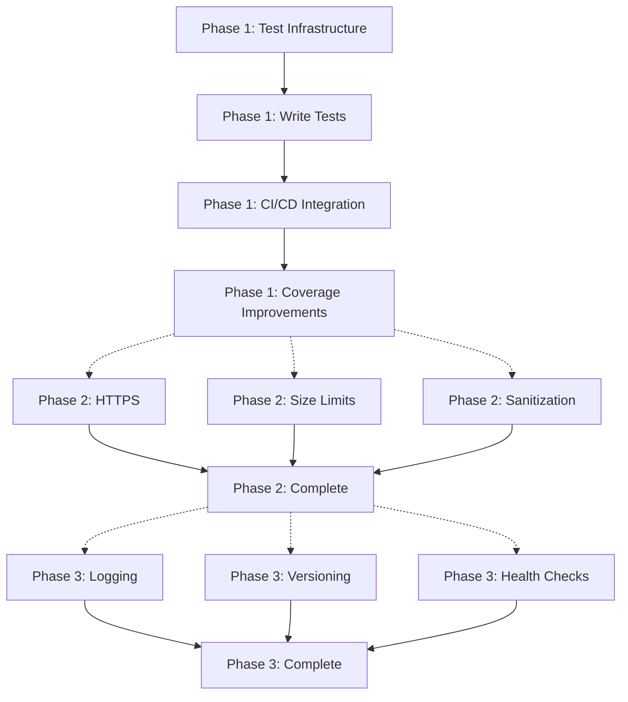

# Credit Management System - Next Iteration Implementation Plan

## Document Information

**Version**: 2.0
**Date**: 2025-12-13
**Status**: Ready for Implementation
**Current Project Grade**: B+ (82-85%)
**Target After Implementation**: A- (90%+)

**Current Git Status**:
- Branch: `master`
- Recent security improvements: All critical vulnerabilities resolved ✅
- Pending changes: Documentation updates, middleware improvements, validation enhancements

**Key Achievements Since Last Iteration**:
- ✅ Hardcoded admin password vulnerability resolved ([auth-service/handlers/auth.go:543-582](auth-service/handlers/auth.go))
- ✅ Rate limiting implemented ([auth-service/utils/middleware.go:105-224](auth-service/utils/middleware.go))
- ✅ MIME type validation enhanced ([credit-activity-service/handlers/attachment.go:653-757](credit-activity-service/handlers/attachment.go))
- ✅ Permission checks completed ([credit-activity-service/utils/middleware.go:120-178](credit-activity-service/utils/middleware.go))
- ✅ UUID validation strengthened ([credit-activity-service/utils/validator.go:102-115](credit-activity-service/utils/validator.go))
- ✅ Error message disclosure fixed ([credit-activity-service/utils/response.go:99-104](credit-activity-service/utils/response.go))

---

## 1. Overview

This document outlines the detailed implementation plan for the next iteration of improvements to the Credit Management System. Based on the security fixes completed in the previous iteration (see [project-evaluation-v2.md](project-evaluation-v2.md)), the focus now shifts to:

1. **Automated Testing** (Critical - Tier 1) - Primary blocker for enterprise deployment
2. **Security Hardening** (Important - Tier 2) - Production best practices
3. **Quality Improvements** (Nice to Have - Tier 3) - Enhanced observability and maintainability

---

## 2. Phase 1: Automated Testing Foundation

### Priority: CRITICAL ⚠️
### Impact: Elevates project to enterprise-grade, enables regression detection

**Why This Matters**:
- Current testing coverage: **20%** (manual testing only)
- Target coverage: **60-70%** (automated tests with CI/CD)
- Primary blocker for enterprise-scale production deployment
- Essential for maintaining code quality during ongoing development

**Current State**:
- ❌ No unit tests for business logic
- ❌ No integration tests for API endpoints
- ❌ No automated test execution in CI/CD
- ❌ No test coverage reporting
- ✅ Manual testing scripts available ([tester/](tester/) directory)

### 2.1 Objectives

- Achieve 60%+ code coverage
- Test all critical business paths
- Enable regression detection
- Integrate with CI/CD pipeline
- Establish testing culture

### 2.2 Technology Stack

```yaml
Go Testing:
  - testing: Go standard library
  - testify: Assertions and test suites
  - httptest: HTTP endpoint testing
  - gomock: Mock generation (if needed)

Database:
  - testcontainers-go: Isolated test database
  - OR docker-compose for test services

Coverage:
  - go test -cover
  - gocov: Coverage reports
  - codecov: Coverage visualization
```

### 2.3 Implementation Tasks

#### Task 1.1: Test Infrastructure Setup

**Objective**: Establish testing framework and test environment

**Dependencies to Install**:

```bash
# Install dependencies
go get github.com/stretchr/testify
go get github.com/testcontainers/testcontainers-go
go get github.com/axw/gocov/gocov

# Create test structure
mkdir -p auth-service/handlers/tests
mkdir -p user-service/handlers/tests
mkdir -p credit-activity-service/handlers/tests
mkdir -p test-utils

# Create test database configuration
# test-utils/database.go
```

**Files to Create**:
- `test-utils/database.go`: Test database helper
- `test-utils/fixtures.go`: Test data fixtures
- `test-utils/assertions.go`: Custom assertions
- `.github/workflows/test.yml`: Test workflow

#### Task 1.2: Authentication Tests

**Test File**: `auth-service/handlers/auth_test.go`
**Focus**: Complete authentication flow coverage including rate limiting
**Related Files**:
- [auth-service/handlers/auth.go](auth-service/handlers/auth.go) - Login, register, token management
- [auth-service/utils/middleware.go:105-224](auth-service/utils/middleware.go) - Rate limiting middleware

```go
func TestLogin(t *testing.T) {
    // Test cases:
    // 1. Valid credentials → 200 with JWT tokens
    // 2. Invalid password → 401
    // 3. Non-existent user → 401
    // 4. Missing fields → 400
    // 5. Rate limiting → 429 after 5 attempts
}

func TestTokenRefresh(t *testing.T) {
    // Test cases:
    // 1. Valid refresh token → 200 with new access token
    // 2. Expired refresh token → 401
    // 3. Invalid refresh token → 401
    // 4. Blacklisted token → 401
}

func TestLogout(t *testing.T) {
    // Test cases:
    // 1. Valid token → 200, token blacklisted
    // 2. Already logged out token → 401
    // 3. Invalid token → 401
}

func TestRateLimiting(t *testing.T) {
    // Test cases:
    // 1. 5 requests → all succeed
    // 2. 6th request → 429
    // 3. After 1 minute → allowed again
    // 4. Different IPs → independent limits
}
```

**Coverage Target**: 80% of auth handlers

---

#### Task 1.3: Activity Lifecycle Tests

**Test File**: `credit-activity-service/handlers/activity_test.go`
**Focus**: Complete activity state machine and CRUD operations
**Related Files**:
- [credit-activity-service/handlers/](credit-activity-service/handlers/) - Activity handlers
- [credit-activity-service/models/](credit-activity-service/models/) - Activity models

```go
func TestActivityCreation(t *testing.T) {
    // Test cases:
    // 1. Valid data → 201 with activity
    // 2. Missing required fields → 400
    // 3. Invalid dates → 400
    // 4. Invalid category → 400
    // 5. Unauthorized user → 401
}

func TestActivitySubmission(t *testing.T) {
    // Test cases:
    // 1. Draft → Pending Review → 200
    // 2. Already submitted → 400
    // 3. Not owner → 403
    // 4. Non-existent activity → 404
}

func TestActivityReview(t *testing.T) {
    // Test cases:
    // 1. Approve as teacher → 200, status approved
    // 2. Reject as teacher → 200, status rejected
    // 3. As student → 403
    // 4. Already reviewed → 400
    // 5. Not in pending review state → 400
}

func TestActivityDeletion(t *testing.T) {
    // Test cases:
    // 1. Owner deletes own activity → 200
    // 2. Admin deletes any activity → 200
    // 3. Teacher tries to delete → 403
    // 4. Activity with participants → 400 or cascade
}

func TestActivityFiltering(t *testing.T) {
    // Test cases:
    // 1. By status → correct activities returned
    // 2. By category → correct activities returned
    // 3. By date range → correct activities returned
    // 4. Combined filters → correct activities returned
    // 5. Pagination → correct page returned
}
```

**Coverage Target**: 70% of activity handlers

---

#### Task 1.4: Participant Management Tests

**Test File**: `credit-activity-service/handlers/participant_test.go`
**Focus**: Participant operations, batch credit assignment, leave functionality

```go
func TestAddParticipants(t *testing.T) {
    // Test cases:
    // 1. Valid UUIDs → 200, participants added
    // 2. Duplicate participants → 400
    // 3. Invalid UUIDs → 400
    // 4. Not activity owner → 403
    // 5. Non-existent activity → 404
}

func TestRemoveParticipant(t *testing.T) {
    // Test cases:
    // 1. Valid participant → 200, removed
    // 2. Non-participant → 404
    // 3. Not activity owner → 403
}

func TestBatchCreditAssignment(t *testing.T) {
    // Test cases:
    // 1. Valid credits → 200, all updated
    // 2. Negative credits → 400
    // 3. Credits > 100 → 400
    // 4. Not activity owner → 403
}

func TestStudentLeaveActivity(t *testing.T) {
    // Test cases:
    // 1. Participant leaves → 200, removed
    // 2. Non-participant tries to leave → 400
    // 3. Teacher tries to leave → 403
}
```

**Coverage Target**: 75% of participant handlers

---

#### Task 1.5: File Upload Security Tests

**Test File**: `credit-activity-service/handlers/attachment_test.go`
**Focus**: Comprehensive file validation and MIME type detection
**Related Files**:
- [credit-activity-service/handlers/attachment.go:653-757](credit-activity-service/handlers/attachment.go) - Enhanced MIME validation

```go
func TestFileUpload(t *testing.T) {
    // Test cases:
    // 1. Valid PDF → 200, file saved
    // 2. Valid image (JPEG, PNG) → 200
    // 3. Valid Office doc → 200
    // 4. Malicious file with fake extension → 400
    // 5. Oversized file → 400
    // 6. Unsupported type → 400
    // 7. Not activity owner → 403
}

func TestFileDownload(t *testing.T) {
    // Test cases:
    // 1. Valid attachment → 200, correct content-type
    // 2. Non-existent attachment → 404
    // 3. Unauthorized user → 403 (if private)
}

func TestMIMETypeValidation(t *testing.T) {
    // Test cases:
    // 1. .pdf with PDF content → valid
    // 2. .pdf with JPEG content → invalid
    // 3. .docx with ZIP content → valid (Office format)
    // 4. .jpg with PDF content → invalid
}
```

**Coverage Target**: 80% of attachment handlers

---

#### Task 1.6: Permission Middleware Tests

**Test File**: `credit-activity-service/utils/middleware_test.go`
**Focus**: Authorization checks and access control
**Related Files**:
- [credit-activity-service/utils/middleware.go:120-178](credit-activity-service/utils/middleware.go) - Permission check implementation

```go
func TestActivityOwnerOrTeacherOrAdmin(t *testing.T) {
    // Test cases:
    // 1. Teacher accesses any activity → allowed
    // 2. Admin accesses any activity → allowed
    // 3. Student accesses own activity → allowed
    // 4. Student accesses other's activity → 403
    // 5. Non-existent activity → 404
}

func TestRateLimitMiddleware(t *testing.T) {
    // Test cases:
    // 1. Under limit → allowed
    // 2. At limit → allowed
    // 3. Over limit → 429
    // 4. After window expires → allowed again
}
```

**Coverage Target**: 90% of middleware

---

#### Task 1.7: Validation Tests

**Test File**: `credit-activity-service/utils/validator_test.go`
**Focus**: Input validation and data sanitization
**Related Files**:
- [credit-activity-service/utils/validator.go:102-115](credit-activity-service/utils/validator.go) - Enhanced UUID validation

```go
func TestUUIDValidation(t *testing.T) {
    // Test cases:
    // 1. Valid UUID v4 → valid
    // 2. Invalid format → invalid
    // 3. Empty string → invalid
    // 4. Wrong length → invalid
    // 5. Invalid characters → invalid
}

func TestCreditValidation(t *testing.T) {
    // Test cases:
    // 1. 0-100 → valid
    // 2. Negative → invalid
    // 3. > 100 → invalid
}

func TestDateRangeValidation(t *testing.T) {
    // Test cases:
    // 1. Start < End → valid
    // 2. Start > End → invalid
    // 3. Invalid format → invalid
}
```

**Coverage Target**: 95% of validators

---

#### Task 1.8: CI/CD Integration

**Objective**: Automate test execution in GitHub Actions
**File**: `.github/workflows/test.yml`

```yaml
name: Tests

on:
  push:
    branches: [ master, develop ]
  pull_request:
    branches: [ master, develop ]

jobs:
  test:
    runs-on: ubuntu-latest

    services:
      postgres:
        image: postgres:15
        env:
          POSTGRES_PASSWORD: testpass
          POSTGRES_DB: test_db
        options: >-
          --health-cmd pg_isready
          --health-interval 10s
          --health-timeout 5s
          --health-retries 5
        ports:
          - 5432:5432

      redis:
        image: redis:7
        options: >-
          --health-cmd "redis-cli ping"
          --health-interval 10s
          --health-timeout 5s
          --health-retries 5
        ports:
          - 6379:6379

    steps:
    - uses: actions/checkout@v3

    - name: Set up Go
      uses: actions/setup-go@v4
      with:
        go-version: '1.21'

    - name: Install dependencies
      run: |
        go mod download
        go install github.com/axw/gocov/gocov@latest

    - name: Run tests
      env:
        DB_HOST: localhost
        DB_PORT: 5432
        DB_USER: postgres
        DB_PASSWORD: testpass
        DB_NAME: test_db
        REDIS_HOST: localhost
        REDIS_PORT: 6379
      run: |
        cd auth-service && go test -v -cover ./... && cd ..
        cd user-service && go test -v -cover ./... && cd ..
        cd credit-activity-service && go test -v -cover ./... && cd ..

    - name: Generate coverage report
      run: |
        go test -coverprofile=coverage.out ./...
        go tool cover -html=coverage.out -o coverage.html

    - name: Upload coverage
      uses: actions/upload-artifact@v3
      with:
        name: coverage-report
        path: coverage.html

    - name: Check coverage threshold
      run: |
        coverage=$(go tool cover -func=coverage.out | grep total | awk '{print $3}' | sed 's/%//')
        if (( $(echo "$coverage < 50" | bc -l) )); then
          echo "Coverage $coverage% is below 50% threshold"
          exit 1
        fi
```

### 2.4 Success Criteria

- [ ] All tests pass in local environment
- [ ] All tests pass in CI/CD
- [ ] Coverage ≥ 60% (target: 70%)
- [ ] No flaky tests
- [ ] Tests run in < 5 minutes
- [ ] Coverage report generated and uploaded

### 2.5 Deliverables

1. **Test Files** (7 files):
   - `auth-service/handlers/auth_test.go`
   - `user-service/handlers/user_test.go`
   - `credit-activity-service/handlers/activity_test.go`
   - `credit-activity-service/handlers/participant_test.go`
   - `credit-activity-service/handlers/attachment_test.go`
   - `credit-activity-service/utils/middleware_test.go`
   - `credit-activity-service/utils/validator_test.go`

2. **Test Utilities** (3 files):
   - `test-utils/database.go`
   - `test-utils/fixtures.go`
   - `test-utils/assertions.go`

3. **CI/CD Configuration**:
   - `.github/workflows/test.yml`

4. **Documentation**:
   - `docs/TESTING.md` - Testing guide

---

## 3. Phase 2: Security Hardening

### Priority: IMPORTANT 🔒
### Impact: Production-grade security posture

**Current State**:
- ✅ Core security issues resolved (see [project-evaluation-v2.md](project-evaluation-v2.md))
- ✅ CORS properly configured ([api-gateway/main.go:216-241](api-gateway/main.go))
- ✅ Rate limiting active ([auth-service/utils/middleware.go:105-224](auth-service/utils/middleware.go))
- ⚠️ HTTPS enforcement - Not implemented (deployment-time configuration)
- ⚠️ Request size limits - Not enforced
- ⚠️ Input sanitization - Partial (validation exists, sanitization missing)

**Why This Matters**:
- Prepares system for public-facing deployments
- Implements defense-in-depth security layers
- Protects against common web application attacks
- Meets security compliance requirements

---

### 3.1 Task 2.1: HTTPS Enforcement

**Objective**: Force HTTPS connections and implement security headers
**Related Services**: All services (auth, user, credit-activity, api-gateway)

**File**: `auth-service/utils/middleware.go`, `user-service/utils/middleware.go`, `credit-activity-service/utils/middleware.go`

```go
// HTTPSRedirectMiddleware redirects HTTP to HTTPS
func HTTPSRedirectMiddleware() gin.HandlerFunc {
    return func(c *gin.Context) {
        if c.Request.Header.Get("X-Forwarded-Proto") == "http" {
            httpsURL := "https://" + c.Request.Host + c.Request.RequestURI
            c.Redirect(http.StatusMovedPermanently, httpsURL)
            c.Abort()
            return
        }
        c.Next()
    }
}

// SecurityHeadersMiddleware adds security headers
func SecurityHeadersMiddleware() gin.HandlerFunc {
    return func(c *gin.Context) {
        // HSTS - Force HTTPS for 1 year
        c.Header("Strict-Transport-Security", "max-age=31536000; includeSubDomains")

        // Prevent clickjacking
        c.Header("X-Frame-Options", "DENY")

        // XSS protection
        c.Header("X-Content-Type-Options", "nosniff")
        c.Header("X-XSS-Protection", "1; mode=block")

        // CSP
        c.Header("Content-Security-Policy", "default-src 'self'; script-src 'self' 'unsafe-inline'; style-src 'self' 'unsafe-inline'")

        c.Next()
    }
}
```

**Apply to all services**:
```go
r.Use(HTTPSRedirectMiddleware())
r.Use(SecurityHeadersMiddleware())
```

**Docker Compose**: Update nginx configuration

```nginx
server {
    listen 443 ssl http2;
    server_name your-domain.com;

    ssl_certificate /etc/nginx/ssl/cert.pem;
    ssl_certificate_key /etc/nginx/ssl/key.pem;

    ssl_protocols TLSv1.2 TLSv1.3;
    ssl_ciphers HIGH:!aNULL:!MD5;
    ssl_prefer_server_ciphers on;

    add_header Strict-Transport-Security "max-age=31536000; includeSubDomains" always;

    # ... rest of config
}

# Redirect HTTP to HTTPS
server {
    listen 80;
    server_name your-domain.com;
    return 301 https://$server_name$request_uri;
}
```

---

### 3.2 Task 2.2: Request Size Limits

**Objective**: Prevent large payload attacks and resource exhaustion
**Target Files**: All service middleware files

**File**: `auth-service/utils/middleware.go` (and similar for other services)

```go
// RequestSizeLimitMiddleware limits request body size
func RequestSizeLimitMiddleware(maxBytes int64) gin.HandlerFunc {
    return func(c *gin.Context) {
        if c.Request.ContentLength > maxBytes {
            c.JSON(http.StatusRequestEntityTooLarge, gin.H{
                "code":    413,
                "message": fmt.Sprintf("请求体过大，最大允许 %d MB", maxBytes/1024/1024),
                "data":    nil,
            })
            c.Abort()
            return
        }

        // Limit reader to prevent abuse
        c.Request.Body = http.MaxBytesReader(c.Writer, c.Request.Body, maxBytes)
        c.Next()
    }
}
```

**Apply with different limits**:
```go
// General routes: 1MB
api.Use(RequestSizeLimitMiddleware(1 * 1024 * 1024))

// File upload routes: 20MB
attachments.Use(RequestSizeLimitMiddleware(20 * 1024 * 1024))
```

**Add to env.example**:
```bash
# Request size limits
MAX_REQUEST_SIZE=1048576  # 1MB for regular requests
MAX_FILE_SIZE=20971520    # 20MB for file uploads
```

---

### 3.3 Task 2.3: Input Sanitization

**Objective**: Add HTML escaping and XSS prevention layer
**Target**: User-provided text fields across all services
**Related**: Complements existing validation ([credit-activity-service/utils/validator.go](credit-activity-service/utils/validator.go))

**File**: `credit-activity-service/utils/sanitizer.go` (new file)

```go
package utils

import (
    "html"
    "strings"
)

type Sanitizer struct{}

func NewSanitizer() *Sanitizer {
    return &Sanitizer{}
}

// SanitizeString removes HTML tags and escapes special characters
func (s *Sanitizer) SanitizeString(input string) string {
    // Remove HTML tags
    input = strings.ReplaceAll(input, "<", "&lt;")
    input = strings.ReplaceAll(input, ">", "&gt;")

    // Escape other special characters
    input = html.EscapeString(input)

    // Trim whitespace
    input = strings.TrimSpace(input)

    return input
}

// SanitizeActivity sanitizes activity fields
func (s *Sanitizer) SanitizeActivity(activity *models.ActivityRequest) {
    activity.Title = s.SanitizeString(activity.Title)
    activity.Description = s.SanitizeString(activity.Description)
    activity.Category = s.SanitizeString(activity.Category)
}

// SanitizeUser sanitizes user fields
func (s *Sanitizer) SanitizeUser(user *models.UserRequest) {
    user.Username = s.SanitizeString(user.Username)
    user.RealName = s.SanitizeString(user.RealName)
    user.Email = s.SanitizeString(user.Email)
}
```

**Apply in handlers**:
```go
func (h *ActivityHandler) CreateActivity(c *gin.Context) {
    var req models.ActivityRequest
    if err := c.ShouldBindJSON(&req); err != nil {
        utils.SendBadRequest(c, "请求参数错误")
        return
    }

    // Sanitize input
    sanitizer := utils.NewSanitizer()
    sanitizer.SanitizeActivity(&req)

    // ... rest of handler
}
```

### 3.4 Deliverables

1. **HTTPS Enforcement**:
   - HSTS headers in all services
   - Security headers middleware
   - Nginx HTTPS configuration
   - TLS certificate setup documentation

2. **Request Size Limits**:
   - Size limit middleware
   - Per-route limit configuration
   - Environment variable configuration

3. **Input Sanitization**:
   - Sanitizer utility
   - Applied to all user inputs
   - XSS prevention tests

4. **Documentation**:
   - `docs/SECURITY.md` - Security configuration guide

---

## 4. Phase 3: Quality & Observability

### Priority: RECOMMENDED 📊
### Impact: Better debugging, monitoring, and maintainability

**Current State**:
- ⚠️ Basic logging only (`log.Printf()` throughout codebase)
- ❌ No structured logs or log levels
- ❌ No request ID tracking for distributed tracing
- ❌ No API versioning (all endpoints at `/api/*`)
- ✅ Basic health checks exist ([API Gateway health endpoint](api-gateway/main.go))
- ❌ Limited dependency health monitoring

**Why This Matters**:
- Facilitates troubleshooting in production environments
- Enables performance monitoring and optimization
- Supports API evolution without breaking changes
- Improves operational visibility

---

### 4.1 Task 3.1: Structured Logging

**Objective**: Replace basic logging with structured, leveled logging
**Recommended Library**: Zap (high performance) or Logrus (community standard)
**Target**: All services (auth, user, credit-activity, api-gateway)

**Installation**:
```bash
go get go.uber.org/zap
```

**File**: `auth-service/utils/logger.go` (new file)

```go
package utils

import (
    "go.uber.org/zap"
    "go.uber.org/zap/zapcore"
    "os"
)

var Logger *zap.Logger

func InitLogger(env string) error {
    var config zap.Config

    if env == "production" {
        config = zap.NewProductionConfig()
        config.EncoderConfig.TimeKey = "timestamp"
        config.EncoderConfig.EncodeTime = zapcore.ISO8601TimeEncoder
    } else {
        config = zap.NewDevelopmentConfig()
    }

    logger, err := config.Build(
        zap.AddCallerSkip(1),
        zap.AddStacktrace(zapcore.ErrorLevel),
    )
    if err != nil {
        return err
    }

    Logger = logger
    return nil
}

// Convenience functions
func Info(msg string, fields ...zap.Field) {
    Logger.Info(msg, fields...)
}

func Error(msg string, fields ...zap.Field) {
    Logger.Error(msg, fields...)
}

func Warn(msg string, fields ...zap.Field) {
    Logger.Warn(msg, fields...)
}

func Debug(msg string, fields ...zap.Field) {
    Logger.Debug(msg, fields...)
}
```

**Request ID Middleware**:
```go
func RequestIDMiddleware() gin.HandlerFunc {
    return func(c *gin.Context) {
        requestID := c.GetHeader("X-Request-ID")
        if requestID == "" {
            requestID = generateRequestID()
        }
        c.Set("request_id", requestID)
        c.Header("X-Request-ID", requestID)
        c.Next()
    }
}

func LoggingMiddleware() gin.HandlerFunc {
    return func(c *gin.Context) {
        start := time.Now()
        path := c.Request.URL.Path
        query := c.Request.URL.RawQuery

        c.Next()

        latency := time.Since(start)
        requestID, _ := c.Get("request_id")

        Logger.Info("HTTP Request",
            zap.String("request_id", requestID.(string)),
            zap.String("method", c.Request.Method),
            zap.String("path", path),
            zap.String("query", query),
            zap.Int("status", c.Writer.Status()),
            zap.Duration("latency", latency),
            zap.String("client_ip", c.ClientIP()),
            zap.String("user_agent", c.Request.UserAgent()),
        )
    }
}
```

**Replace all log.Printf**:
```go
// Before:
log.Printf("User logged in: %s", username)

// After:
utils.Logger.Info("User logged in",
    zap.String("username", username),
    zap.String("user_type", userType),
)
```

---

### 4.2 Task 3.2: API Versioning

**Objective**: Implement versioned API endpoints for future compatibility
**Strategy**: Add `/v1/` prefix to all routes
**Current**: All routes at `/api/*` (e.g., `/api/auth/login`)
**Target**: All routes at `/api/v1/*` (e.g., `/api/v1/auth/login`)

**Migration Strategy**: Maintain backward compatibility during transition

1. **Update API Gateway**:
```go
// Old: /api/auth
// New: /api/v1/auth
apiV1 := api.Group("/v1")
{
    auth := apiV1.Group("/auth")
    // ... routes
}

// Keep old routes for backward compatibility (temporary)
api.Group("/auth").Any("/*path", func(c *gin.Context) {
    newPath := "/api/v1" + c.Request.URL.Path
    c.Redirect(http.StatusMovedPermanently, newPath)
})
```

2. **Update all services**:
```go
// auth-service, user-service, credit-activity-service
api := r.Group("/api/v1")
```

3. **Update frontend API client**:
```typescript
// frontend/src/config/api.ts
export const API_BASE_URL = '/api/v1'
```

4. **Update documentation**: All README files, API docs

---

### 4.3 Task 3.3: Enhanced Health Checks

**Objective**: Implement comprehensive health monitoring endpoints
**Current**: Basic health check exists ([api-gateway/main.go](api-gateway/main.go))
**Target**: Detailed health status with dependency checks

**File**: `auth-service/handlers/health.go` (new file)

```go
package handlers

import (
    "context"
    "net/http"
    "time"

    "github.com/gin-gonic/gin"
    "gorm.io/gorm"
)

type HealthHandler struct {
    db    *gorm.DB
    redis *utils.RedisClient
}

func NewHealthHandler(db *gorm.DB, redis *utils.RedisClient) *HealthHandler {
    return &HealthHandler{db: db, redis: redis}
}

type HealthStatus struct {
    Status      string            `json:"status"`
    Service     string            `json:"service"`
    Version     string            `json:"version"`
    Timestamp   time.Time         `json:"timestamp"`
    Checks      map[string]string `json:"checks"`
    Uptime      float64           `json:"uptime_seconds"`
}

var startTime = time.Now()

func (h *HealthHandler) HealthCheck(c *gin.Context) {
    checks := make(map[string]string)
    overallStatus := "healthy"

    // Database check
    ctx, cancel := context.WithTimeout(context.Background(), 2*time.Second)
    defer cancel()

    sqlDB, err := h.db.DB()
    if err != nil || sqlDB.PingContext(ctx) != nil {
        checks["database"] = "unhealthy"
        overallStatus = "unhealthy"
    } else {
        checks["database"] = "healthy"
    }

    // Redis check
    ctx, cancel = context.WithTimeout(context.Background(), 2*time.Second)
    defer cancel()

    if err := h.redis.client.Ping(ctx).Err(); err != nil {
        checks["redis"] = "unhealthy"
        overallStatus = "degraded"
    } else {
        checks["redis"] = "healthy"
    }

    status := HealthStatus{
        Status:    overallStatus,
        Service:   "auth-service",
        Version:   "1.0.0",
        Timestamp: time.Now(),
        Checks:    checks,
        Uptime:    time.Since(startTime).Seconds(),
    }

    statusCode := http.StatusOK
    if overallStatus == "unhealthy" {
        statusCode = http.StatusServiceUnavailable
    }

    c.JSON(statusCode, status)
}

// Simple liveness probe
func (h *HealthHandler) Liveness(c *gin.Context) {
    c.JSON(http.StatusOK, gin.H{"status": "alive"})
}

// Detailed readiness probe
func (h *HealthHandler) Readiness(c *gin.Context) {
    // Check if service is ready to accept requests
    // (database connected, migrations done, etc.)
    h.HealthCheck(c)
}
```

**Apply to all services**:
```go
healthHandler := handlers.NewHealthHandler(db, redisClient)

r.GET("/health", healthHandler.HealthCheck)
r.GET("/health/live", healthHandler.Liveness)
r.GET("/health/ready", healthHandler.Readiness)
```

### 4.4 Deliverables

1. **Structured Logging**:
   - Zap logger integration
   - Request ID tracking
   - JSON log format
   - Log levels configuration

2. **API Versioning**:
   - `/api/v1/` prefix on all routes
   - Backward compatibility redirects
   - Updated documentation

3. **Enhanced Health Checks**:
   - Detailed health endpoints
   - Dependency status checks
   - Uptime tracking
   - Liveness/readiness probes

4. **Documentation**:
   - `docs/LOGGING.md` - Logging guide
   - `docs/API_VERSIONING.md` - Versioning strategy
   - Updated API documentation

---

## 5. Implementation Roadmap

### Phase 1: Testing Foundation (Critical Priority)

**Tasks in Order** (dependencies considered):

1. **Test Infrastructure Setup** → Must complete first
   - Install dependencies (testify, testcontainers-go, gocov)
   - Create test directory structure
   - Set up test database configuration
   - Create test utilities (database.go, fixtures.go, assertions.go)

2. **Core Test Implementation** → Can be done in parallel once infrastructure is ready
   - Authentication Tests (auth_test.go)
   - Activity Lifecycle Tests (activity_test.go)
   - Participant Management Tests (participant_test.go)
   - File Upload Security Tests (attachment_test.go)

3. **Validation & Middleware Tests** → Can run in parallel with core tests
   - Permission Middleware Tests (middleware_test.go)
   - Validation Tests (validator_test.go)

4. **CI/CD Integration** → Must complete after tests are written
   - Create GitHub Actions workflow (.github/workflows/test.yml)
   - Configure test database in CI
   - Set up coverage reporting
   - Configure coverage thresholds

5. **Coverage Improvements** → Iterative process
   - Review coverage reports
   - Identify gaps
   - Add missing tests
   - Aim for 60%+ overall coverage

---

### Phase 2: Security Hardening (Important Priority)

**Tasks in Order**:

1. **HTTPS Enforcement** → Independent task
   - Add HSTS and security headers middleware
   - Update nginx configuration in docker-compose
   - Document TLS certificate setup

2. **Request Size Limits** → Independent task
   - Implement size limit middleware
   - Configure per-service limits
   - Add environment variable configuration
   - Update env.example

3. **Input Sanitization** → Can run in parallel with above
   - Create sanitizer utility
   - Apply to all user input handlers
   - Add sanitization tests
   - Update security documentation

---

### Phase 3: Quality & Observability (Recommended Priority)

**Tasks in Order**:

1. **Structured Logging** → Should complete first (useful for other tasks)
   - Choose and install logging library (Zap recommended)
   - Create logger utility with request ID support
   - Replace all log.Printf() calls
   - Add logging middleware
   - Configure log levels per environment

2. **API Versioning** → Can be done independently
   - Update API Gateway routes to /api/v1/*
   - Update all service routes
   - Add backward compatibility redirects
   - Update frontend API client
   - Update all API documentation

3. **Enhanced Health Checks** → Can be done independently
   - Create health handler with dependency checks
   - Add liveness and readiness probes
   - Apply to all services
   - Update deployment configurations

---

### Task Dependencies Summary



**Legend**:
- Solid arrows (→): Must complete in order
- Dotted arrows (-.->): Recommended order, but not required

---

## 6. Success Metrics

### Phase 1: Testing
- [ ] Code coverage ≥ 60%
- [ ] All critical paths tested
- [ ] CI/CD tests passing
- [ ] Zero flaky tests
- [ ] Test execution time < 5 min

### Phase 2: Security
- [ ] HTTPS enforced everywhere
- [ ] HSTS headers active
- [ ] Request size limits working
- [ ] Input sanitization applied
- [ ] Security scan passing

### Phase 3: Quality
- [ ] Structured logs in all services
- [ ] Request ID tracking active
- [ ] API versioning implemented
- [ ] Health checks comprehensive
- [ ] Documentation complete

---

## 7. Risks & Mitigation

### Risk 1: Testing Implementation Complexity
**Probability**: Medium
**Impact**: High (blocks enterprise deployment)
**Mitigation Strategies**:
- Start with highest-priority tests (authentication, activity lifecycle)
- Use test generation tools and templates
- Leverage existing manual test scripts ([tester/](tester/) directory) as reference
- Consider pair programming for complex test scenarios
- Break down large test files into smaller, focused test suites

### Risk 2: Breaking Changes from API Versioning
**Probability**: Low
**Impact**: Medium (affects existing clients)
**Mitigation Strategies**:
- Maintain backward compatibility with redirects during transition
- Implement gradual rollout approach
- Communication plan for API consumers (if external)
- Comprehensive integration testing before rollout
- Document all breaking changes clearly

### Risk 3: Performance Impact from Logging
**Probability**: Low
**Impact**: Low
**Mitigation Strategies**:
- Use high-performance logger (Zap recommended over Logrus)
- Implement async logging for non-critical logs
- Configure appropriate log levels per environment
- Performance testing before and after implementation
- Monitor latency metrics during rollout

### Risk 4: CI/CD Test Execution Time
**Probability**: Medium
**Impact**: Low (developer experience)
**Mitigation Strategies**:
- Optimize test database setup (use testcontainers effectively)
- Run tests in parallel where possible
- Cache dependencies in CI pipeline
- Set reasonable timeout values
- Consider splitting slow tests into separate workflow

---

## 8. Post-Implementation Review

After completing all phases:

1. **Regression Testing**: Ensure all existing functionality still works
2. **Performance Testing**: Verify no significant performance degradation
3. **Security Audit**: Independent review of security improvements
4. **Documentation Review**: Ensure all docs are up-to-date
5. **Team Training**: Train team on new testing practices and tools

---

## 9. Future Considerations (Phase 4+)

These enhancements can be considered after completing Phases 1-3:

### Advanced Monitoring & Observability
**Objective**: Production-grade monitoring infrastructure
**Components**:
- Prometheus metrics collection (request latency, error rates, DB query performance)
- Grafana dashboards (service health, business metrics, user activity)
- Alert rules configuration (service down, high error rate, performance degradation)
- Distributed tracing (Jaeger or Zipkin integration)
**Benefits**: Proactive issue detection, performance optimization insights

### Audit Logging & Compliance
**Objective**: Comprehensive audit trail for sensitive operations
**Scope**:
- Sensitive operation logging (user creation/deletion, permission changes, data exports)
- Compliance tracking (GDPR, educational records regulations)
- Audit log APIs (query audit history, generate compliance reports)
- Log retention policies
**Benefits**: Regulatory compliance, security incident investigation

### Performance Optimization
**Objective**: Scale system for larger deployments
**Areas**:
- Database query optimization (identify and fix N+1 queries, add indexes)
- Caching strategy enhancement (Redis cache for frequent queries)
- CDN integration (static asset delivery, frontend caching)
- Database connection pooling tuning
- API response pagination improvements
**Benefits**: Support 10,000+ concurrent users, faster response times

### Feature Enhancements
**Objective**: Expand functionality based on user feedback
**Potential Features**:
- **Email Notifications** - Activity approval, deadline reminders, weekly summaries
- **Calendar View** - Visual activity timeline, conflict detection, iCal export
- **PDF Reporting** - Customizable credit reports, certificates, transcripts
- **Template Library** - Pre-built activity templates, template sharing, categories
- **Mobile App** - React Native mobile client, push notifications
- **Analytics Dashboard** - Credit trends, participation rates, department statistics
**Approach**: Prioritize based on user feedback and usage analytics

---

## Document Metadata

**Document Status**: Ready for Implementation
**Version**: 2.0
**Last Updated**: 2025-12-13
**Next Review**: After Phase 1 completion
**Owner**: Development Team
**Stakeholders**: Product, Security, Operations

**Related Documents**:
- [project-evaluation-v2.md](project-evaluation-v2.md) - Current project assessment
- [README.md](README.md) - Project overview and setup guide
- [DATABASE_SCHEMA.md](docs/DATABASE_SCHEMA.md) - Database design
- [PERMISSION_CONTROL_DIAGRAM.md](docs/PERMISSION_CONTROL_DIAGRAM.md) - Authorization system

**Implementation Notes**:
- This is a living document - update as implementation progresses
- Track completed tasks by checking off success criteria
- Document any deviations from the plan with rationale
- Update risk assessment as new risks emerge
- Add lessons learned during implementation

**Getting Started**:
1. Review current project state in [project-evaluation-v2.md](project-evaluation-v2.md)
2. Start with Phase 1 (Testing Foundation) - highest priority
3. Follow the implementation roadmap (Section 5)
4. Check off success metrics as you complete tasks (Section 6)
5. Update this document with progress and findings

---

**Questions or Concerns?**
- Discuss in team meetings or project issues
- Consult related documentation for context
- Update this plan if requirements change
