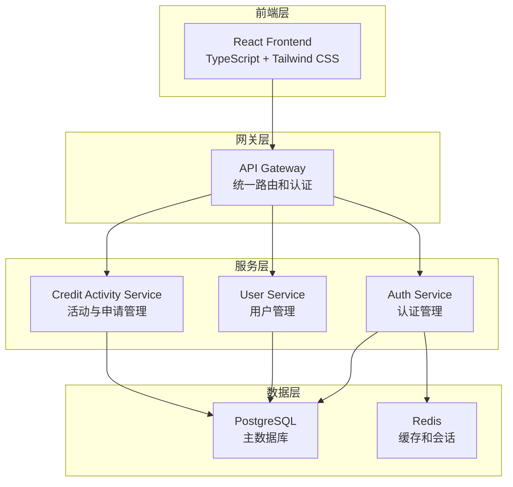
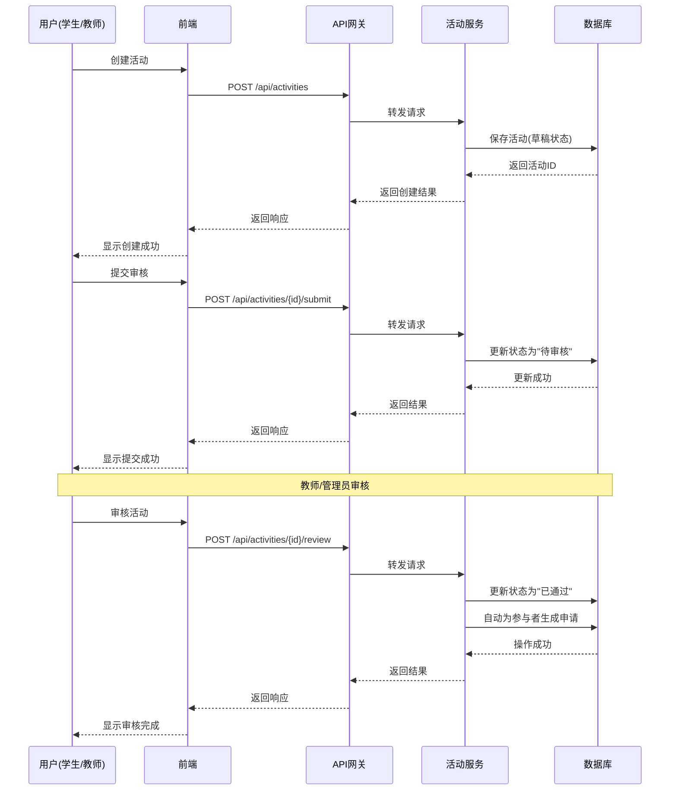
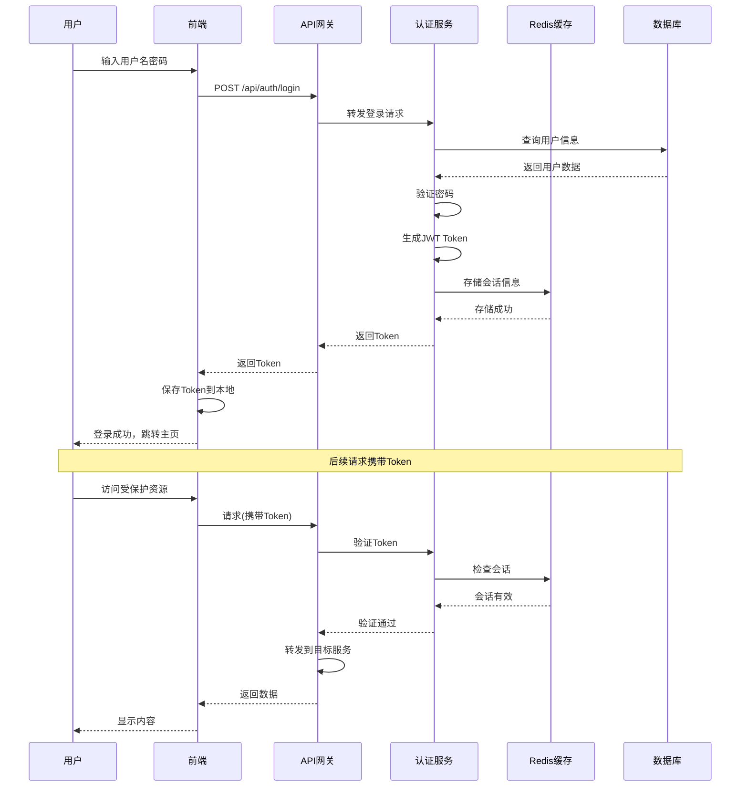
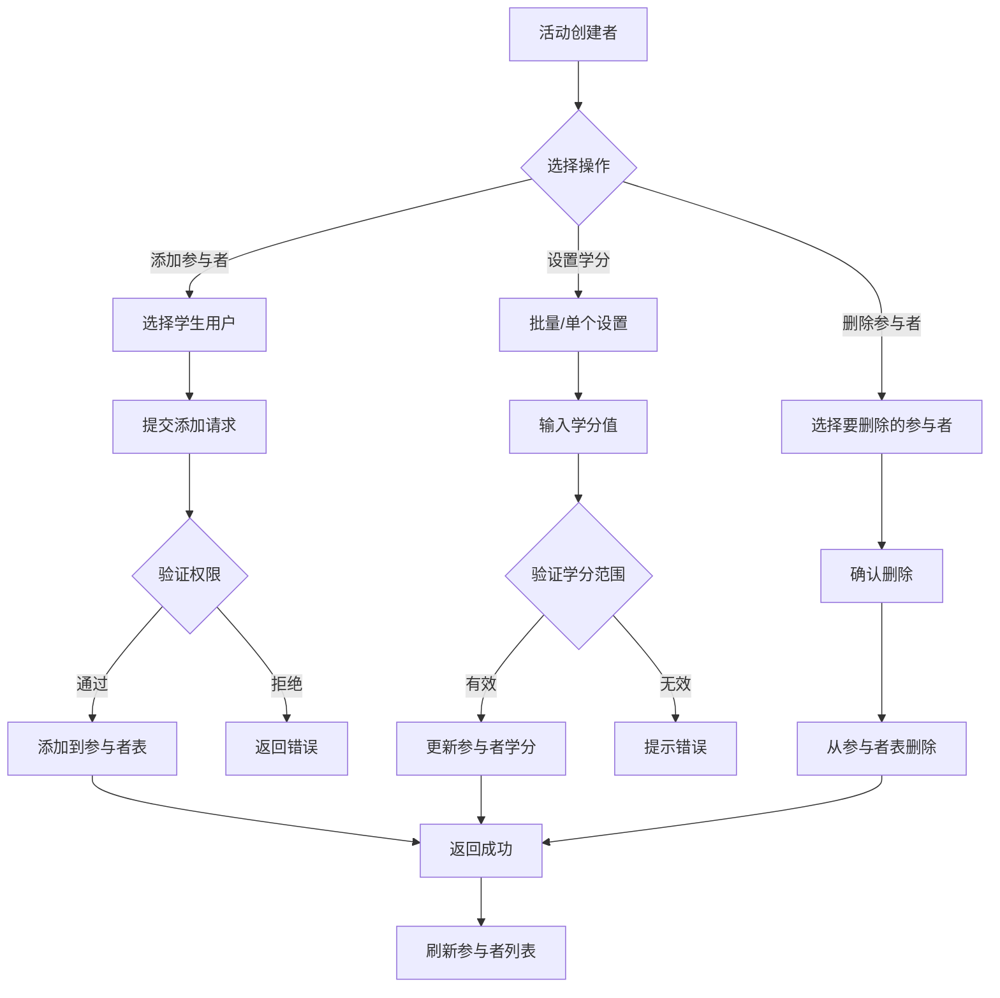

# 🎓 学分活动管理系统

[](https://golang.org/)
[](https://reactjs.org/)
[](https://www.typescriptlang.org/)
[](https://www.postgresql.org/)
[](https://redis.io/)
[](https://www.docker.com/)

> 一个现代化的学分活动管理平台，采用微服务架构设计，支持学生和教师创建、管理学分活动，实现自动化的申请生成和学分分配。系统包含完整的权限控制、文件管理、数据统计等功能。

## ✨ 核心特性

- 🏗️ **微服务架构** - 高聚合低耦合，易于扩展和维护
- 🔐 **统一认证** - JWT 认证，完善的权限控制系统
- 📊 **智能统计** - 实时数据统计和可视化展示
- 🚀 **自动化流程** - 活动审核通过后自动生成申请
- 📱 **响应式设计** - 现代化的前端界面，支持多设备访问
- 🐳 **容器化部署** - Docker 一键部署，简化运维
- 📈 **实时监控** - 完整的健康检查和性能监控
- 📁 **文件管理** - 支持多种文件格式上传和预览
- 🔍 **高级搜索** - 强大的搜索和筛选功能
- 📋 **批量操作** - 支持批量导入导出和批量处理

## 🏗️ 系统架构



### 微服务组件

| 服务                           | 端口 | 技术栈                            | 功能描述                  |
| ------------------------------ | ---- | --------------------------------- | ------------------------- |
| 🎨 **Frontend**                | 3000 | React + TypeScript + Tailwind CSS | 现代化前端界面            |
| 🌐 **API Gateway**             | 8080 | Go + Gin                          | 统一 API 入口，路由转发   |
| 🔐 **Auth Service**            | 8081 | Go + Gin + JWT                    | 认证管理，JWT 验证        |
| 👥 **User Service**            | 8084 | Go + Gin + GORM                   | 统一用户管理（学生/教师） |
| 📚 **Credit Activity Service** | 8083 | Go + Gin + GORM                   | 学分活动与申请管理        |
| 🗄️ **PostgreSQL**              | 5432 | PostgreSQL 15+                    | 主数据库                  |
| 🔴 **Redis**                   | 6379 | Redis 7.2+                        | 缓存和会话存储            |

## 📊 系统业务流程

### 活动创建与审核流程



### 用户认证流程



### 参与者管理流程



## 🚀 快速开始

### 环境要求

- Docker & Docker Compose
- Git

### 一键启动

```bash
# 克隆项目
git clone https://github.com/EmptyDust/credit-management
cd credit-management

# 启动所有服务
docker-compose up -d

# 查看服务状态
docker-compose ps

# 查看日志
docker-compose logs -f
```

### 访问地址

- 🌐 **前端应用**: http://localhost:3000
- 🔌 **API 网关**: http://localhost:8080
- 📊 **健康检查**: http://localhost:8080/health
- 🗄️ **数据库**: localhost:5432
- 🔴 **Redis**: localhost:6379

### 默认账户

- **管理员**: admin / admin123
- **教师**: teacher / teacher123
- **学生**: student / student123

## 🛠️ 技术栈

### 后端技术

<div align="center">


</div>

### 前端技术

<div align="center">


</div>

## 📋 核心功能

### 🎯 活动管理

- **创建活动** - 学生和教师都可以创建学分活动（草稿状态）
- **状态管理** - 草稿 → 待审核 → 通过/拒绝的完整流程
- **参与者管理** - 灵活的参与者添加和学分分配（仅限学生用户）
- **撤回机制** - 支持从待审核状态撤回活动到草稿状态
- **批量操作** - 支持批量创建、更新、删除、导入导出活动数据
- **活动复制** - 支持复制现有活动创建新活动
- **模板功能** - 支持保存活动为模板，快速创建相似活动

### 👥 用户管理

- **统一用户系统** - 学生和教师信息统一管理
- **角色权限** - 细粒度的权限控制（学生/教师/管理员）
- **搜索功能** - 强大的用户搜索和筛选
- **个人信息** - 完整的用户资料管理

### 📊 申请系统

- **自动生成** - 活动审核通过后，自动为所有参与者生成申请记录（状态为 approved）
- **批量处理** - 支持批量学分设置和批量删除参与者
- **数据导出** - 灵活的申请数据导出功能（学生仅导出自己的，教师/管理员可导出全部）
- **状态跟踪** - 申请状态固定为 approved（自动生成），支持查看申请详情和统计信息

### 📁 文件管理

- **多格式支持** - 支持 PDF、Word、Excel、图片等多种格式
- **文件预览** - 在线文件预览功能
- **安全存储** - 文件安全存储和访问控制
- **批量上传** - 支持批量文件上传

### 🔍 统计分析

- **实时统计** - 活动、申请、用户数据统计
- **可视化展示** - 直观的数据图表
- **趋势分析** - 历史数据趋势分析
- **报表导出** - 支持多种格式的报表导出

## 🔌 API 接口

### 认证相关

```http
POST /api/auth/login          # 用户登录
POST /api/auth/register       # 用户注册
POST /api/auth/validate-token # 验证 token
POST /api/auth/refresh-token  # 刷新 token
POST /api/auth/logout         # 用户登出
```

### 用户管理

```http
GET  /api/users               # 获取用户列表
POST /api/users               # 创建用户
GET  /api/users/{id}          # 获取用户详情
PUT  /api/users/{id}          # 更新用户信息
DELETE /api/users/{id}        # 删除用户
GET  /api/users/profile       # 获取当前用户信息
PUT  /api/users/profile       # 更新当前用户信息
GET  /api/users/stats         # 获取用户统计
```

### 活动管理

```http
# 基础操作（所有认证用户）
POST   /api/activities                  # 创建活动
GET    /api/activities                  # 获取活动列表（支持分页、搜索、筛选）
GET    /api/activities/{id}             # 获取活动详情
PUT    /api/activities/{id}             # 更新活动（仅草稿状态）
POST   /api/activities/{id}/submit      # 提交活动审核（仅草稿状态）
POST   /api/activities/{id}/withdraw    # 撤回活动（仅待审核状态）
POST   /api/activities/{id}/copy        # 复制活动
GET    /api/activities/categories       # 获取活动类别列表
GET    /api/activities/templates        # 获取活动模板列表
GET    /api/activities/stats            # 获取活动统计信息

# 教师/管理员专用
POST   /api/activities/{id}/review      # 审核活动（通过/拒绝）
GET    /api/activities/pending          # 获取待审核活动列表
POST   /api/activities/batch            # 批量创建活动
PUT    /api/activities/batch            # 批量更新活动
POST   /api/activities/batch-delete     # 批量删除活动
POST   /api/activities/import           # 批量导入活动（CSV/Excel）
GET    /api/activities/csv-template     # 下载CSV导入模板
GET    /api/activities/excel-template   # 下载Excel导入模板
GET    /api/activities/export           # 导出活动数据
GET    /api/activities/report           # 获取活动报告

# 删除活动（精细权限控制：创建者/教师/管理员）
DELETE /api/activities/{id}             # 删除活动
```

### 参与者管理

```http
# 基础查询（所有认证用户）
GET    /api/activities/{id}/participants              # 获取参与者列表（支持分页）
GET    /api/activities/{id}/participants/stats        # 获取参与者统计
GET    /api/activities/{id}/participants/export       # 导出参与者列表
GET    /api/activities/{id}/my-activities             # 获取用户参与的活动

# 参与者管理（活动创建者/教师/管理员）
POST   /api/activities/{id}/participants              # 添加参与者（仅限学生）
PUT    /api/activities/{id}/participants/batch-credits # 批量设置学分
PUT    /api/activities/{id}/participants/{uuid}/credits # 设置单个学分
DELETE /api/activities/{id}/participants/{uuid}       # 删除参与者
POST   /api/activities/{id}/participants/batch-remove # 批量删除参与者

# 学生专用
POST   /api/activities/{id}/leave                     # 退出活动（仅学生）
```

### 申请管理

```http
# 基础操作（所有认证用户）
GET    /api/applications                # 获取用户申请列表（学生只看自己的）
GET    /api/applications/{id}           # 获取申请详情
GET    /api/applications/stats          # 获取申请统计
GET    /api/applications/export         # 导出申请数据（学生仅导出自己的）

# 教师/管理员专用
GET    /api/applications/all            # 获取所有申请列表
```

### 附件管理

```http
# 基础操作（所有认证用户）
GET    /api/activities/{id}/attachments                    # 获取附件列表
GET    /api/activities/{id}/attachments/{attachment_id}/download # 下载附件
GET    /api/activities/{id}/attachments/{attachment_id}/preview  # 预览附件

# 附件管理（活动创建者/教师/管理员）
POST   /api/activities/{id}/attachments                    # 上传附件
POST   /api/activities/{id}/attachments/batch              # 批量上传附件
PUT    /api/activities/{id}/attachments/{attachment_id}    # 更新附件信息
DELETE /api/activities/{id}/attachments/{attachment_id}    # 删除附件
```

### 搜索功能

```http
# 高级搜索（所有认证用户）
GET    /api/search/activities           # 搜索活动
GET    /api/search/applications         # 搜索申请
GET    /api/search/participants         # 搜索参与者
GET    /api/search/attachments          # 搜索附件
```

## 🗄️ 数据库设计

### 核心表结构

```sql
-- 用户表
users (
    id UUID PRIMARY KEY,
    username VARCHAR(20) UNIQUE NOT NULL,
    password VARCHAR(255) NOT NULL,
    email VARCHAR(100) UNIQUE NOT NULL,
    real_name VARCHAR(50) NOT NULL,
    user_type VARCHAR(20) NOT NULL, -- student, teacher, admin
    status VARCHAR(20) NOT NULL DEFAULT 'active',
    -- 学生特有字段
    student_id VARCHAR(8) UNIQUE,
    college VARCHAR(100),
    major VARCHAR(100),
    class VARCHAR(50),
    grade VARCHAR(4),
    -- 教师特有字段
    department VARCHAR(100),
    title VARCHAR(50)
)

-- 学分活动表
credit_activities (
    id UUID PRIMARY KEY,
    title VARCHAR(200) NOT NULL,
    description TEXT,
    start_date TIMESTAMPTZ,
    end_date TIMESTAMPTZ,
    status VARCHAR(20) NOT NULL DEFAULT 'draft',
    category VARCHAR(100) NOT NULL,
    details JSONB NOT NULL DEFAULT '{}'::jsonb,  -- 扩展字段，存储活动类型特定信息
    owner_id UUID NOT NULL,
    reviewer_id UUID,
    review_comments TEXT,
    reviewed_at TIMESTAMPTZ,
    created_at TIMESTAMPTZ,
    updated_at TIMESTAMPTZ,
    deleted_at TIMESTAMPTZ
)

-- 活动参与者表
activity_participants (
    id UUID PRIMARY KEY,
    activity_id UUID NOT NULL,
    user_id UUID NOT NULL,  -- 注意：字段名是user_id，存储的是用户UUID
    credits DECIMAL(5,2) NOT NULL DEFAULT 0,
    joined_at TIMESTAMPTZ NOT NULL DEFAULT CURRENT_TIMESTAMP,
    created_at TIMESTAMPTZ,
    updated_at TIMESTAMPTZ,
    deleted_at TIMESTAMPTZ
)

-- 申请表（自动生成）
applications (
    id UUID PRIMARY KEY,
    activity_id UUID NOT NULL,
    user_id UUID NOT NULL,  -- 注意：字段名是user_id，存储的是用户UUID
    status VARCHAR(20) NOT NULL DEFAULT 'approved',
    applied_credits DECIMAL(5,2) NOT NULL,
    awarded_credits DECIMAL(5,2) NOT NULL,
    submitted_at TIMESTAMPTZ NOT NULL DEFAULT CURRENT_TIMESTAMP,
    created_at TIMESTAMPTZ,
    updated_at TIMESTAMPTZ,
    deleted_at TIMESTAMPTZ
)

-- 附件表
attachments (
    id UUID PRIMARY KEY,
    activity_id UUID NOT NULL,
    file_name VARCHAR(255) NOT NULL,
    original_name VARCHAR(255) NOT NULL,
    file_size BIGINT NOT NULL,
    file_type VARCHAR(20) NOT NULL,
    file_category VARCHAR(50) NOT NULL,
    uploaded_by UUID NOT NULL,
    uploaded_at TIMESTAMPTZ NOT NULL DEFAULT CURRENT_TIMESTAMP
)
```

### 自动化流程

系统通过应用层逻辑（而非数据库触发器）实现自动化：

- **申请自动生成** - 活动审核通过后，在 `activity_side_effects.go` 中自动为所有参与者生成申请记录
- **申请自动删除** - 活动从已通过状态变为其他状态时，自动软删除相关申请
- **文件清理** - 活动删除时自动检测并清理孤立的附件文件（基于 MD5 哈希）
- **数据完整性** - 级联删除和约束检查由数据库外键和 GORM 软删除机制保证

## 🧪 测试

### 自动化测试脚本

```bash
# 测试认证服务
cd tester && .\test-auth-service.ps1

# 测试用户服务
cd tester && .\test-user-service.ps1

# 测试学分活动服务
cd tester && .\test-credit-activity-service.ps1

# 综合测试
cd tester && .\test-all-services.ps1
```

## 🚀 部署

### 开发环境

```bash
# 启动数据库
docker-compose up postgres redis -d

# 运行服务
cd auth-service && go run main.go
cd user-service && go run main.go
cd credit-activity-service && go run main.go

# 运行前端
cd frontend && npm run dev
```

### 生产环境

```bash
# 构建并启动所有服务
docker-compose -f docker-compose.prod.yml up -d

# 查看服务状态
docker-compose ps

# 查看日志
docker-compose logs -f

# 备份数据库
docker-compose exec postgres pg_dump -U postgres credit_management > backup.sql
```

## 📁 项目结构

```
credit-management/
├── 📁 api-gateway/              # API 网关服务
│   ├── main.go
│   ├── Dockerfile
│   └── README.md
├── 📁 auth-service/             # 认证服务
│   ├── handlers/
│   ├── models/
│   ├── utils/
│   ├── main.go
│   ├── Dockerfile
│   └── README.md
├── 📁 user-service/             # 统一用户服务
│   ├── handlers/
│   ├── models/
│   ├── utils/
│   ├── main.go
│   ├── Dockerfile
│   └── README.md
├── 📁 credit-activity-service/  # 学分活动服务
│   ├── handlers/
│   ├── models/
│   ├── utils/
│   ├── main.go
│   ├── Dockerfile
│   └── README.md
├── 📁 frontend/                 # React 前端应用
│   ├── src/
│   │   ├── components/
│   │   ├── pages/
│   │   ├── contexts/
│   │   ├── hooks/
│   │   ├── lib/
│   │   └── types/
│   ├── package.json
│   └── Dockerfile
├── 📁 database/                 # 数据库脚本和配置
│   ├── init.sql
│   ├── backups/
│   └── Dockerfile
├── 📁 docs/                     # 项目文档
│   ├── DATABASE_SCHEMA.md
│   ├── PERMISSION_CONTROL_DIAGRAM.md
│   ├── PERMISSION_DIAGRAM.md
│   └── credit-activity-service-design.md
├── 📁 redis/                    # Redis 配置
│   ├── redis.conf
│   └── start-redis.sh
├── 🐳 docker-compose.yml        # Docker 编排配置
├── 🐳 build-docker.sh          # Docker 构建脚本
└── 📖 README.md                 # 项目说明文档
```

## 🔧 环境变量

| 变量名        | 说明            | 默认值              |
| ------------- | --------------- | ------------------- |
| `DB_HOST`     | 数据库主机      | `localhost`         |
| `DB_PORT`     | 数据库端口      | `5432`              |
| `DB_USER`     | 数据库用户名    | `postgres`          |
| `DB_PASSWORD` | 数据库密码      | `password`          |
| `DB_NAME`     | 数据库名称      | `credit_management` |
| `DB_SSLMODE`  | 数据库 SSL 模式 | `disable`           |
| `JWT_SECRET`  | JWT 密钥        | `your-secret-key`   |
| `REDIS_HOST`  | Redis 主机      | `localhost`         |
| `REDIS_PORT`  | Redis 端口      | `6379`              |
| `PORT`        | 服务端口        | `8080-8084`         |

## 🔒 权限控制

### 用户角色

- **学生 (student)** - 可以创建活动、参与活动、查看自己的申请、退出活动
- **教师 (teacher)** - 可以创建活动、审核活动、管理参与者、查看所有申请
- **管理员 (admin)** - 拥有所有权限，包括用户管理、活动管理、系统配置

### 权限矩阵

| 功能         | 学生   | 教师 | 管理员 | 说明                           |
| ------------ | ------ | ---- | ------ | ------------------------------ |
| 创建活动     | ✅     | ✅   | ✅     | 所有人可创建                   |
| 编辑活动     | 自己的 | ✅   | ✅     | 仅草稿状态可编辑               |
| 删除活动     | 自己的 | ✅   | ✅     | 精细权限控制                   |
| 提交审核     | 自己的 | ✅   | ✅     | 仅草稿状态可提交               |
| 撤回活动     | 自己的 | ✅   | ✅     | 仅待审核状态可撤回             |
| 审核活动     | ❌     | ✅   | ✅     | 仅教师和管理员                 |
| 添加参与者   | 自己的 | ✅   | ✅     | 仅限添加学生用户               |
| 设置学分     | 自己的 | ✅   | ✅     | 支持单个和批量设置             |
| 退出活动     | ✅     | ❌   | ❌     | 仅学生可退出                   |
| 查看所有申请 | ❌     | ✅   | ✅     | 学生仅查看自己的               |
| 批量操作     | ❌     | ✅   | ✅     | 批量创建、更新、删除、导入导出 |
| 用户管理     | ❌     | ❌   | ✅     | 仅管理员                       |
| 系统配置     | ❌     | ❌   | ✅     | 仅管理员                       |

### 快速开始

1. 🍴 Fork 项目
2. 🌿 创建功能分支 (`git checkout -b feature/AmazingFeature`)
3. 💾 提交更改 (`git commit -m 'Add some AmazingFeature'`)
4. 📤 推送到分支 (`git push origin feature/AmazingFeature`)
5. 🔄 创建 Pull Request

### 开发规范

- 使用 TypeScript 进行前端开发
- 使用 Go 进行后端开发
- 遵循 RESTful API 设计规范
- 编写完整的测试用例
- 更新相关文档

## 📝 开发过程与文档

### 开发日志

项目采用 Git 进行版本控制，所有开发过程均有完整的提交记录。查看完整开发历史：

```bash
# 查看提交历史
git log --oneline --graph --all

# 查看最近30次提交
git log --oneline -30
```

**近期重要更新**：

- `cb46ad2` - 修复SQL问题，完善API文档
- `f20429a` - 界面布局优化 (#33)
- `44a4745` - 为后端所有功能增加单元测试，优化日间/夜间模式切换 (#32, #34)
- `70a20aa` - 安全性修复
- `1d01d21` - 添加用户头像功能 (#29)
- `4bb18f6` - 更新README文档 (#28)
- `5bb92b6` - 添加API测试和Docker日志功能 (#25, #27)
- `469696b` - 修复批量导入时的部门验证问题 (#26)
- `802031f` - 问题修复 (#24)
- `e2b4fe0` - 修复多个问题 (#20, #22, #23)

### Issue 跟踪

项目使用 GitHub Issues 进行问题跟踪和功能规划：

- **问题反馈**: [GitHub Issues](https://github.com/EmptyDust/credit-management/issues)
- **功能请求**: 使用 Feature Request 模板
- **Bug 报告**: 使用 Bug Report 模板

### 开发里程碑

1. **阶段一：基础架构搭建**
   - 微服务架构设计
   - 数据库设计与实现
   - 认证系统实现

2. **阶段二：核心功能开发**
   - 活动管理功能
   - 用户管理功能
   - 申请系统实现

3. **阶段三：功能完善**
   - 批量操作功能
   - 文件管理系统
   - 搜索和筛选功能

4. **阶段四：测试与优化**
   - 单元测试覆盖
   - 性能优化
   - 安全性加固

5. **阶段五：文档与部署**
   - API文档完善
   - 部署文档编写
   - 用户手册制作

## 📚 项目文档

### 核心文档

本项目包含完整的技术文档，所有文档位于 `docs/` 目录：

| 文档名称 | 说明 | 路径 |
|---------|------|------|
| **API文档** | 完整的API接口说明，包含所有端点、参数、响应格式 | [docs/API-Documentation.md](docs/API-Documentation.md) |
| **数据库技术报告** | 详细的数据库设计、优化策略和性能分析 | [docs/backend-database-technical-report.md](docs/backend-database-technical-report.md) |
| **数据库技术报告(续)** | 数据库技术报告第二部分 | [docs/backend-database-technical-report-part2.md](docs/backend-database-technical-report-part2.md) |
| **数据库架构设计** | 数据表结构、关系图和索引设计 | [docs/DATABASE_SCHEMA.md](docs/DATABASE_SCHEMA.md) |
| **学分活动服务设计** | 学分活动服务的详细设计文档 | [docs/credit-activity-service-design.md](docs/credit-activity-service-design.md) |
| **权限控制图** | 系统权限控制的详细说明和流程图 | [docs/PERMISSION_CONTROL_DIAGRAM.md](docs/PERMISSION_CONTROL_DIAGRAM.md) |
| **权限矩阵图** | 用户角色权限矩阵 | [docs/PERMISSION_DIAGRAM.md](docs/PERMISSION_DIAGRAM.md) |

### 服务文档

每个微服务都有独立的README文档：

- **API网关**: [api-gateway/README.md](api-gateway/README.md)
- **认证服务**: [auth-service/README.md](auth-service/README.md)
- **用户服务**: [user-service/README.md](user-service/README.md)
- **学分活动服务**: [credit-activity-service/README.md](credit-activity-service/README.md)
- **Redis配置**: [redis/README.md](redis/README.md)
- **测试工具**: [test-utils/README.md](test-utils/README.md)

### 设计文档

- **项目设计说明书**: [项目设计说明书.pdf](项目设计说明书.pdf) - 完整的系统设计文档，包含需求分析、系统设计、技术选型等

## 🎬 演示与视频

### 系统演示

> 📹 **演示视频**: 待添加
>
> 演示视频将展示系统的主要功能，包括：
> - 用户登录与认证
> - 活动创建与管理
> - 活动审核流程
> - 参与者管理
> - 申请查看与导出
> - 批量操作演示

### 功能截图

系统主要功能界面：

1. **登录界面** - 支持学生、教师、管理员登录
2. **仪表盘** - 数据统计和可视化展示
3. **活动列表** - 活动浏览、搜索、筛选
4. **活动详情** - 活动信息、参与者列表、附件管理
5. **活动创建** - 表单填写、参与者添加、文件上传
6. **活动审核** - 教师/管理员审核界面
7. **申请管理** - 申请列表、详情查看、数据导出
8. **用户管理** - 用户列表、信息编辑、批量导入

### 在线体验

> 🌐 **在线演示地址**: 待部署
>
> 测试账号：
> - 管理员: admin / admin123
> - 教师: teacher / teacher123
> - 学生: student / student123

## 📞 联系我们

- 🐛 **问题反馈**: [GitHub Issues](https://github.com/EmptyDust/credit-management/issues)
- 💬 **讨论交流**: [GitHub Discussions](https://github.com/EmptyDust/credit-management/discussions)
- 📧 **邮件联系**: fenglingyexing@gmail.com

## 🙏 致谢

感谢所有为这个项目做出贡献的开发者和用户！

---

<div align="center">

**如果这个项目对你有帮助，请给我们一个 ⭐️**

[](https://github.com/EmptyDust/credit-management)
[](https://github.com/EmptyDust/credit-management)

</div>
