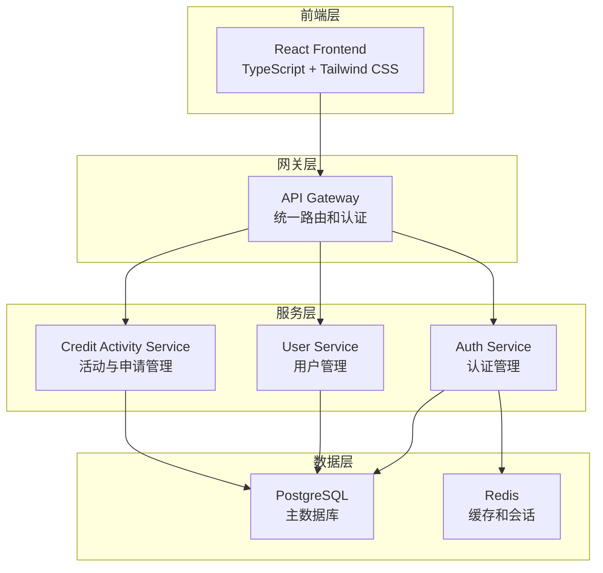

# 🎓 学分活动管理系统

[](https://golang.org/)
[](https://reactjs.org/)
[](https://www.typescriptlang.org/)
[](https://www.postgresql.org/)
[](https://redis.io/)
[](https://www.docker.com/)
[](LICENSE)

> 一个现代化的学分活动管理平台，采用微服务架构设计，支持学生和教师创建、管理学分活动，实现自动化的申请生成和学分分配。系统包含完整的权限控制、文件管理、数据统计等功能。

## ✨ 核心特性

- 🏗️ **微服务架构** - 高聚合低耦合，易于扩展和维护
- 🔐 **统一认证** - JWT 认证，完善的权限控制系统
- 📊 **智能统计** - 实时数据统计和可视化展示
- 🚀 **自动化流程** - 活动审核通过后自动生成申请
- 📱 **响应式设计** - 现代化的前端界面，支持多设备访问
- 🐳 **容器化部署** - Docker 一键部署，简化运维
- 📈 **实时监控** - 完整的健康检查和性能监控
- 📁 **文件管理** - 支持多种文件格式上传和预览
- 🔍 **高级搜索** - 强大的搜索和筛选功能
- 📋 **批量操作** - 支持批量导入导出和批量处理

## 🏗️ 系统架构



### 微服务组件

| 服务 | 端口 | 技术栈 | 功能描述 |
|------|------|--------|----------|
| 🎨 **Frontend** | 3000 | React + TypeScript + Tailwind CSS | 现代化前端界面 |
| 🌐 **API Gateway** | 8080 | Go + Gin | 统一 API 入口，路由转发 |
| 🔐 **Auth Service** | 8081 | Go + Gin + JWT | 认证管理，JWT 验证 |
| 👥 **User Service** | 8084 | Go + Gin + GORM | 统一用户管理（学生/教师） |
| 📚 **Credit Activity Service** | 8083 | Go + Gin + GORM | 学分活动与申请管理 |
| 🗄️ **PostgreSQL** | 5432 | PostgreSQL 15+ | 主数据库 |
| 🔴 **Redis** | 6379 | Redis 7.2+ | 缓存和会话存储 |

## 🚀 快速开始

### 环境要求

- Docker & Docker Compose
- Git

### 一键启动

```bash
# 克隆项目
git clone <repository-url>
cd credit-management

# 启动所有服务
docker-compose up -d

# 查看服务状态
docker-compose ps

# 查看日志
docker-compose logs -f
```

### 访问地址

- 🌐 **前端应用**: http://localhost:3000
- 🔌 **API 网关**: http://localhost:8080
- 📊 **健康检查**: http://localhost:8080/health
- 🗄️ **数据库**: localhost:5432
- 🔴 **Redis**: localhost:6379

### 默认账户

- **管理员**: admin / admin123
- **教师**: teacher / teacher123
- **学生**: student / student123

## 🛠️ 技术栈

### 后端技术

<div align="center">


</div>

### 前端技术

<div align="center">


</div>

## 📋 核心功能

### 🎯 活动管理
- **创建活动** - 学生和教师都可以创建学分活动
- **状态管理** - 草稿 → 待审核 → 通过/拒绝的完整流程
- **参与者管理** - 灵活的参与者添加和学分分配
- **撤回机制** - 支持活动撤回和重新提交
- **批量操作** - 支持批量导入导出活动数据

### 👥 用户管理
- **统一用户系统** - 学生和教师信息统一管理
- **角色权限** - 细粒度的权限控制（学生/教师/管理员）
- **搜索功能** - 强大的用户搜索和筛选
- **个人信息** - 完整的用户资料管理

### 📊 申请系统
- **自动生成** - 活动通过后自动生成申请
- **批量处理** - 支持批量学分设置
- **数据导出** - 灵活的申请数据导出功能
- **状态跟踪** - 完整的申请状态跟踪

### 📁 文件管理
- **多格式支持** - 支持 PDF、Word、Excel、图片等多种格式
- **文件预览** - 在线文件预览功能
- **安全存储** - 文件安全存储和访问控制
- **批量上传** - 支持批量文件上传

### 🔍 统计分析
- **实时统计** - 活动、申请、用户数据统计
- **可视化展示** - 直观的数据图表
- **趋势分析** - 历史数据趋势分析
- **报表导出** - 支持多种格式的报表导出

## 🔌 API 接口

### 认证相关
```http
POST /api/auth/login          # 用户登录
POST /api/auth/register       # 用户注册
POST /api/auth/validate-token # 验证 token
POST /api/auth/refresh-token  # 刷新 token
POST /api/auth/logout         # 用户登出
```

### 用户管理
```http
GET  /api/users               # 获取用户列表
POST /api/users               # 创建用户
GET  /api/users/{id}          # 获取用户详情
PUT  /api/users/{id}          # 更新用户信息
DELETE /api/users/{id}        # 删除用户
GET  /api/users/profile       # 获取当前用户信息
PUT  /api/users/profile       # 更新当前用户信息
GET  /api/users/stats         # 获取用户统计
```

### 活动管理
```http
POST /api/activities                    # 创建活动
GET  /api/activities                    # 获取活动列表
GET  /api/activities/{id}               # 获取活动详情
PUT  /api/activities/{id}               # 更新活动
DELETE /api/activities/{id}             # 删除活动
POST /api/activities/{id}/submit        # 提交活动审核
POST /api/activities/{id}/withdraw      # 撤回活动
POST /api/activities/{id}/review        # 审核活动
POST /api/activities/import             # 批量导入活动
GET  /api/activities/export             # 导出活动数据
```

### 申请管理
```http
GET  /api/applications                  # 获取申请列表
GET  /api/applications/{id}             # 获取申请详情
GET  /api/applications/stats            # 获取申请统计
GET  /api/applications/export           # 导出申请数据
```

### 文件管理
```http
POST /api/attachments                   # 上传文件
GET  /api/attachments/{id}              # 获取文件信息
GET  /api/attachments/{id}/download     # 下载文件
DELETE /api/attachments/{id}            # 删除文件
```

## 🗄️ 数据库设计

### 核心表结构

```sql
-- 用户表
users (
    id UUID PRIMARY KEY,
    username VARCHAR(20) UNIQUE NOT NULL,
    password VARCHAR(255) NOT NULL,
    email VARCHAR(100) UNIQUE NOT NULL,
    real_name VARCHAR(50) NOT NULL,
    user_type VARCHAR(20) NOT NULL, -- student, teacher, admin
    status VARCHAR(20) NOT NULL DEFAULT 'active',
    -- 学生特有字段
    student_id VARCHAR(8) UNIQUE,
    college VARCHAR(100),
    major VARCHAR(100),
    class VARCHAR(50),
    grade VARCHAR(4),
    -- 教师特有字段
    department VARCHAR(100),
    title VARCHAR(50)
)

-- 学分活动表
credit_activities (
    id UUID PRIMARY KEY,
    title VARCHAR(200) NOT NULL,
    description TEXT,
    start_date DATE NOT NULL,
    end_date DATE NOT NULL,
    status VARCHAR(20) NOT NULL DEFAULT 'draft',
    category VARCHAR(100) NOT NULL,
    owner_id UUID NOT NULL,
    reviewer_id UUID,
    review_comments TEXT,
    reviewed_at TIMESTAMPTZ
)

-- 活动参与者表
activity_participants (
    id UUID PRIMARY KEY,
    activity_id UUID NOT NULL,
    id UUID NOT NULL,
    credits DECIMAL(5,2) NOT NULL DEFAULT 0,
    joined_at TIMESTAMPTZ NOT NULL DEFAULT CURRENT_TIMESTAMP
)

-- 申请表（自动生成）
applications (
    id UUID PRIMARY KEY,
    activity_id UUID NOT NULL,
    id UUID NOT NULL,
    status VARCHAR(20) NOT NULL DEFAULT 'approved',
    applied_credits DECIMAL(5,2) NOT NULL,
    awarded_credits DECIMAL(5,2) NOT NULL,
    submitted_at TIMESTAMPTZ NOT NULL DEFAULT CURRENT_TIMESTAMP
)

-- 附件表
attachments (
    id UUID PRIMARY KEY,
    activity_id UUID NOT NULL,
    file_name VARCHAR(255) NOT NULL,
    original_name VARCHAR(255) NOT NULL,
    file_size BIGINT NOT NULL,
    file_type VARCHAR(20) NOT NULL,
    file_category VARCHAR(50) NOT NULL,
    uploaded_by UUID NOT NULL,
    uploaded_at TIMESTAMPTZ NOT NULL DEFAULT CURRENT_TIMESTAMP
)
```

### 自动化触发器

- **申请自动生成** - 活动审核通过后自动为参与者生成申请
- **申请自动删除** - 活动撤回时自动删除相关申请
- **数据完整性** - 级联删除和约束检查

## 🧪 测试

### 自动化测试脚本

```bash
# 测试认证服务
cd tester && .\test-auth-service.ps1

# 测试用户服务
cd tester && .\test-user-service.ps1

# 测试学分活动服务
cd tester && .\test-credit-activity-service.ps1

# 综合测试
cd tester && .\test-all-services.ps1
```

## 🚀 部署

### 开发环境

```bash
# 启动数据库
docker-compose up postgres redis -d

# 运行服务
cd auth-service && go run main.go
cd user-service && go run main.go
cd credit-activity-service && go run main.go

# 运行前端
cd frontend && npm run dev
```

### 生产环境

```bash
# 构建并启动所有服务
docker-compose -f docker-compose.prod.yml up -d

# 查看服务状态
docker-compose ps

# 查看日志
docker-compose logs -f

# 备份数据库
docker-compose exec postgres pg_dump -U postgres credit_management > backup.sql
```

## 📁 项目结构

```
credit-management/
├── 📁 api-gateway/              # API 网关服务
│   ├── main.go
│   └── Dockerfile
├── 📁 auth-service/             # 认证服务
│   ├── handlers/
│   ├── models/
│   ├── utils/
│   ├── main.go
│   └── Dockerfile
├── 📁 user-service/             # 统一用户服务
│   ├── handlers/
│   ├── models/
│   ├── utils/
│   ├── main.go
│   └── Dockerfile
├── 📁 credit-activity-service/  # 学分活动服务
│   ├── handlers/
│   ├── models/
│   ├── utils/
│   ├── main.go
│   └── Dockerfile
├── 📁 frontend/                 # React 前端应用
│   ├── src/
│   │   ├── components/
│   │   ├── pages/
│   │   ├── contexts/
│   │   ├── hooks/
│   │   ├── lib/
│   │   └── types/
│   ├── package.json
│   └── Dockerfile
├── 📁 database/                 # 数据库脚本和配置
│   ├── init.sql
│   ├── backups/
│   └── Dockerfile
├── 📁 docs/                     # 项目文档
│   ├── DATABASE_SCHEMA.md
│   ├── PERMISSION_CONTROL_DIAGRAM.md
│   └── STORED_PROCEDURE_USAGE_GUIDE.md
├── 📁 redis/                    # Redis 配置
│   ├── redis.conf
│   └── start-redis.sh
├── 🐳 docker-compose.yml        # Docker 编排配置
├── 🐳 build-docker.sh          # Docker 构建脚本
└── 📖 README.md                 # 项目说明文档
```

## 🔧 环境变量

| 变量名 | 说明 | 默认值 |
|--------|------|--------|
| `DB_HOST` | 数据库主机 | `localhost` |
| `DB_PORT` | 数据库端口 | `5432` |
| `DB_USER` | 数据库用户名 | `postgres` |
| `DB_PASSWORD` | 数据库密码 | `password` |
| `DB_NAME` | 数据库名称 | `credit_management` |
| `DB_SSLMODE` | 数据库SSL模式 | `disable` |
| `JWT_SECRET` | JWT 密钥 | `your-secret-key` |
| `REDIS_HOST` | Redis 主机 | `localhost` |
| `REDIS_PORT` | Redis 端口 | `6379` |
| `PORT` | 服务端口 | `8080-8084` |

## 🔒 权限控制

### 用户角色

- **学生 (student)** - 可以创建活动、参与活动、查看自己的申请
- **教师 (teacher)** - 可以创建活动、审核活动、管理参与者
- **管理员 (admin)** - 拥有所有权限，包括用户管理、系统配置

### 权限矩阵

| 功能 | 学生 | 教师 | 管理员 |
|------|------|------|--------|
| 创建活动 | ✅ | ✅ | ✅ |
| 编辑活动 | 自己的 | ✅ | ✅ |
| 删除活动 | 自己的 | ✅ | ✅ |
| 审核活动 | ❌ | ✅ | ✅ |
| 用户管理 | ❌ | ❌ | ✅ |
| 系统配置 | ❌ | ❌ | ✅ |

## 🤝 贡献指南

我们欢迎所有形式的贡献！

1. 🍴 Fork 项目
2. 🌿 创建功能分支 (`git checkout -b feature/AmazingFeature`)
3. 💾 提交更改 (`git commit -m 'Add some AmazingFeature'`)
4. 📤 推送到分支 (`git push origin feature/AmazingFeature`)
5. 🔄 创建 Pull Request

### 开发规范

- 使用 TypeScript 进行前端开发
- 使用 Go 进行后端开发
- 遵循 RESTful API 设计规范
- 编写完整的测试用例
- 更新相关文档

## 📄 许可证

本项目采用 MIT 许可证 - 查看 [LICENSE](LICENSE) 文件了解详情。

## 📞 联系我们

- 🐛 **问题反馈**: [GitHub Issues](https://github.com/EmptyDust/credit-management/issues)
- 💬 **讨论交流**: [GitHub Discussions](https://github.com/EmptyDust/credit-management/discussions)
- 📧 **邮件联系**: baiyuxiu@emptydust.com

## 🙏 致谢

感谢所有为这个项目做出贡献的开发者和用户！

---

<div align="center">

**如果这个项目对你有帮助，请给我们一个 ⭐️**

[](https://github.com/EmptyDust/credit-management)
[](https://github.com/EmptyDust/credit-management)

</div>
