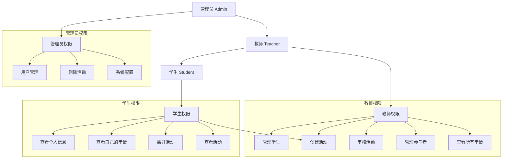
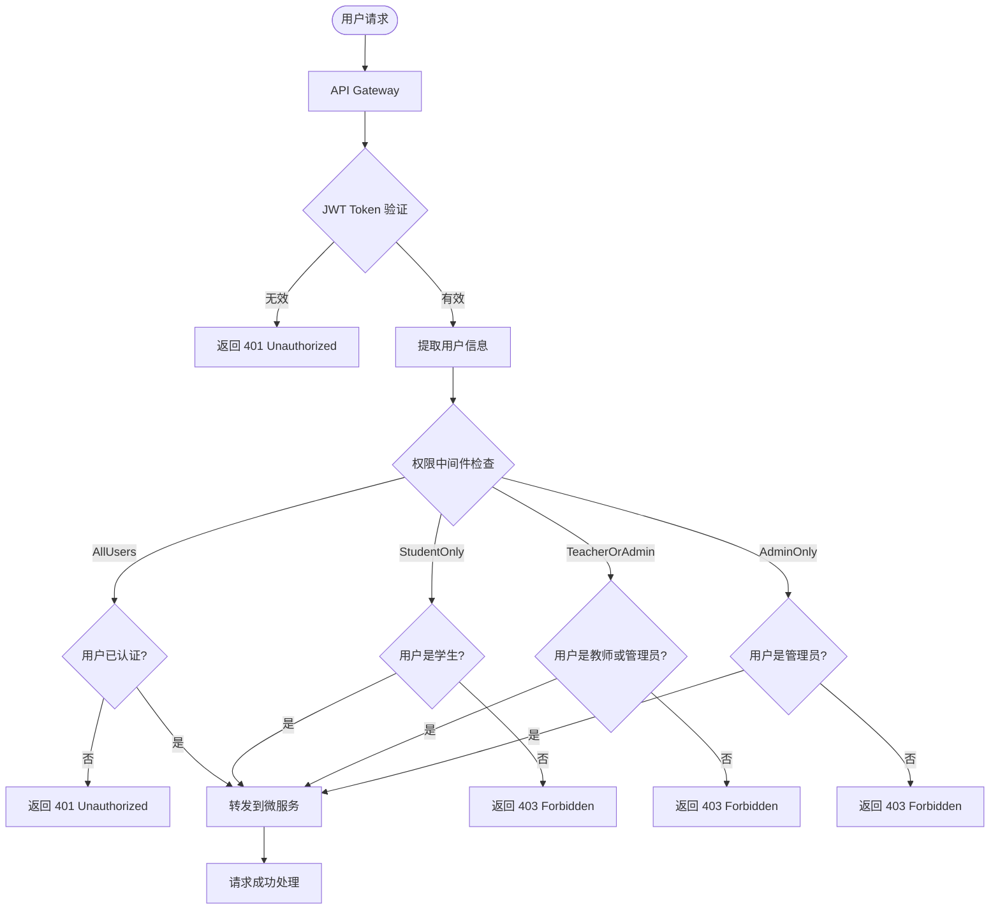
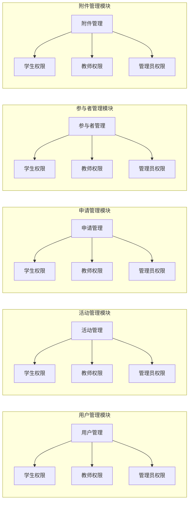
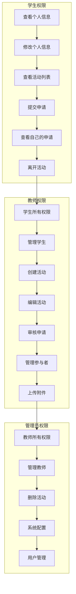
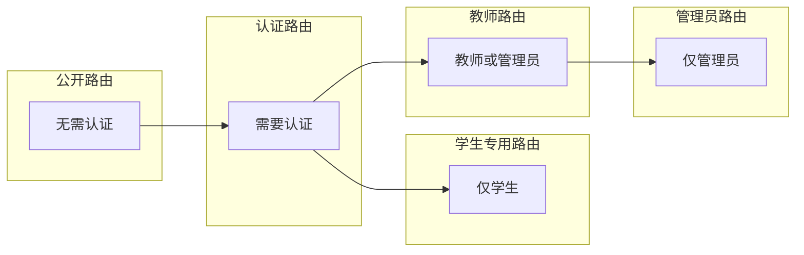
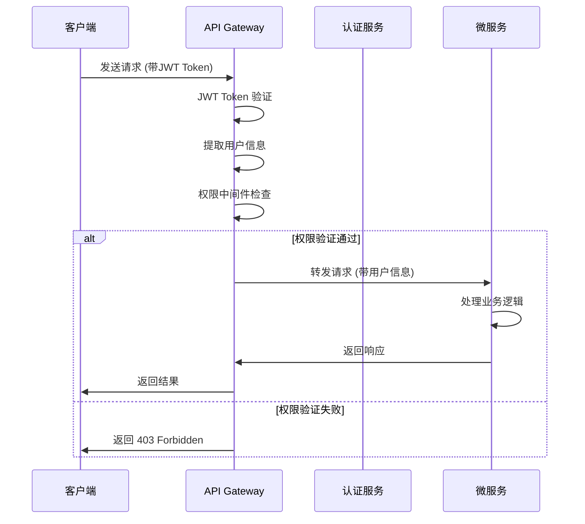
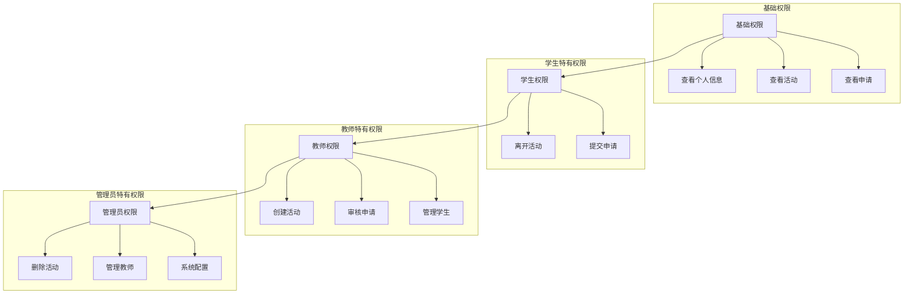
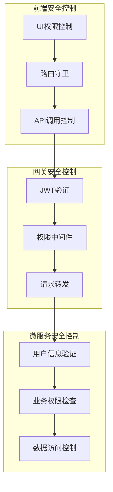
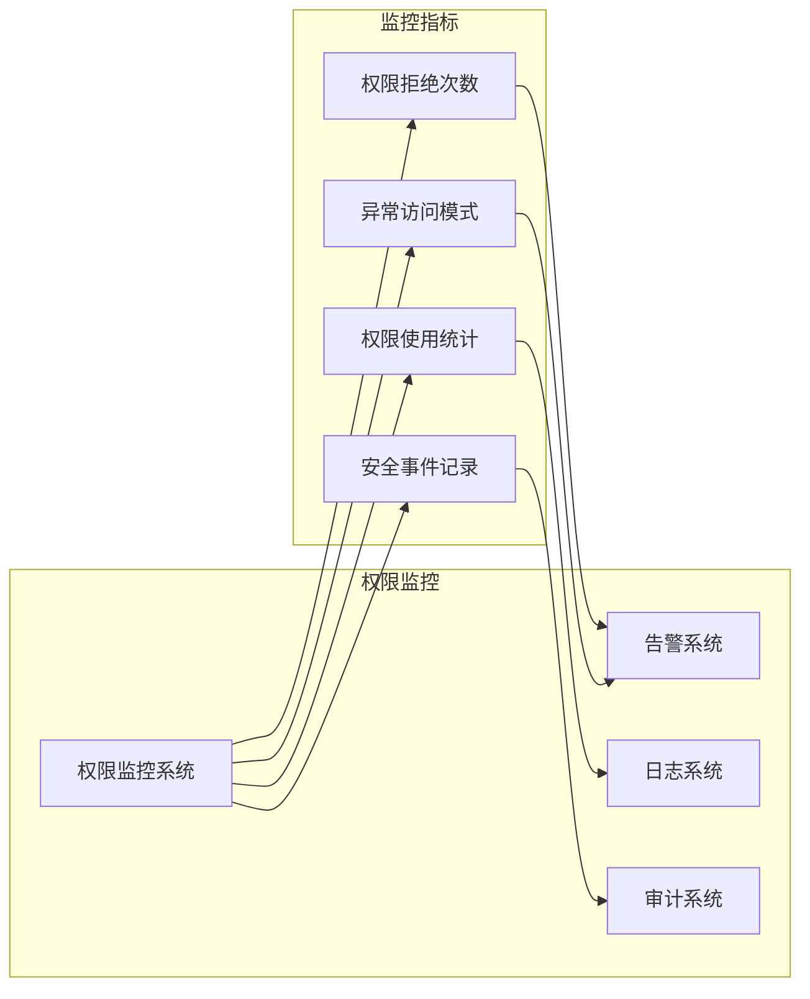

# 权限控制可视化图表

## 1. 系统架构图

```mermaid
graph TB
    Client[客户端] --> Gateway[API Gateway]

    Gateway --> JWT[JWT Middleware]
    Gateway --> Auth[Auth Middleware]
    Gateway --> Permission[Permission Middleware]

    JWT --> Auth
    Auth --> Permission

    Permission --> AuthService[认证服务]
    Permission --> UserService[用户服务]
    Permission --> ActivityService[学分活动服务]

    subgraph "权限中间件"
        AllUsers[AllUsers()]
        StudentOnly[StudentOnly()]
        TeacherOrAdmin[TeacherOrAdmin()]
        AdminOnly[AdminOnly()]
    end

    Permission --> AllUsers
    Permission --> StudentOnly
    Permission --> TeacherOrAdmin
    Permission --> AdminOnly
```

## 2. 用户角色层级图



## 3. 权限控制流程图



## 4. 功能模块权限矩阵



## 5. 详细权限映射图



## 6. API 路由权限分布



## 7. 权限检查时序图



## 8. 权限继承关系图



## 9. 安全控制点图



## 10. 权限监控图



## 图表说明

### 1. 系统架构图

展示了整个系统的权限控制架构，从客户端到微服务的完整流程。

### 2. 用户角色层级图

显示了三种用户角色的权限继承关系，管理员拥有所有权限。

### 3. 权限控制流程图

详细描述了权限验证的决策流程，包括各种权限检查分支。

### 4. 功能模块权限矩阵

展示了不同功能模块对不同用户类型的权限分配。

### 5. 详细权限映射图

具体列出了每种用户类型可以执行的操作。

### 6. API 路由权限分布

显示了 API 路由的权限层级分布。

### 7. 权限检查时序图

展示了权限检查的时序流程。

### 8. 权限继承关系图

详细展示了权限的继承关系。

### 9. 安全控制点图

标识了系统中的关键安全控制点。

### 10. 权限监控图

展示了权限监控和审计的架构。

这些图表提供了完整的权限控制可视化，帮助理解系统的权限架构和安全机制。
